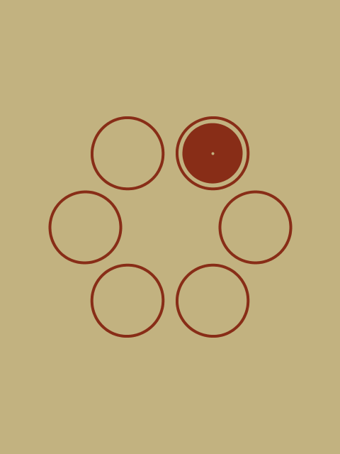
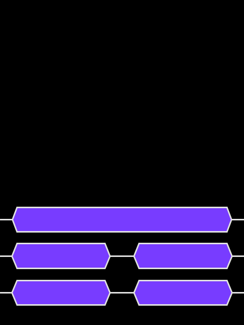
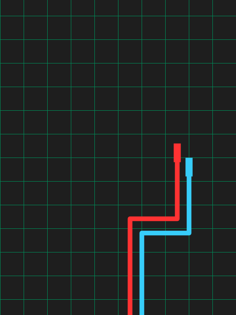
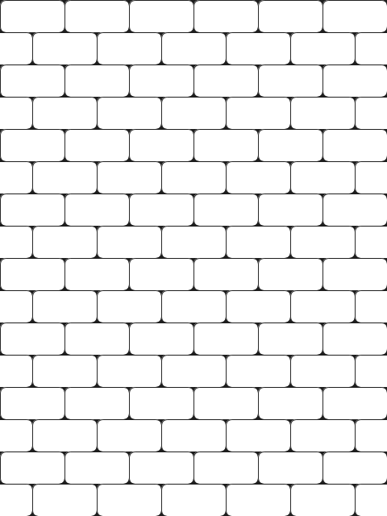
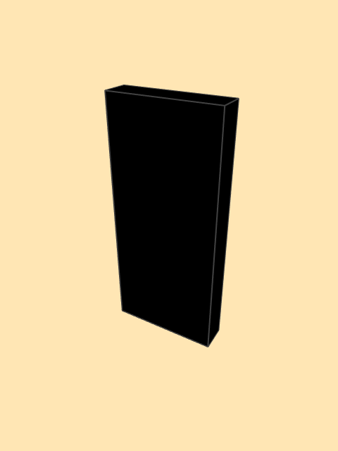
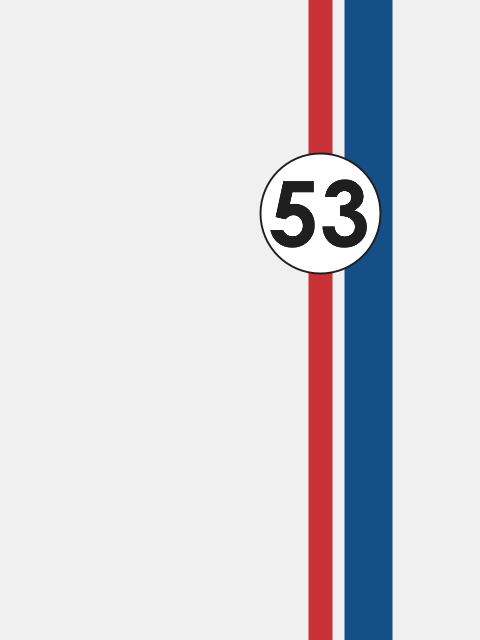
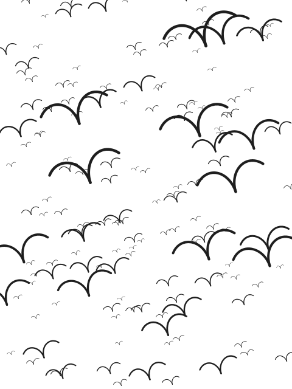
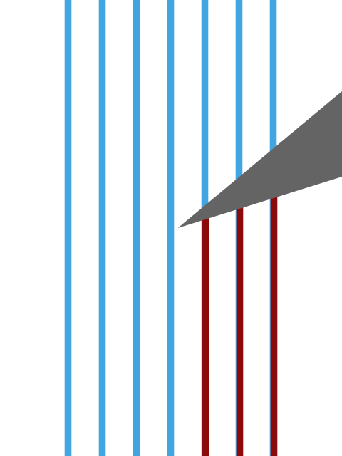
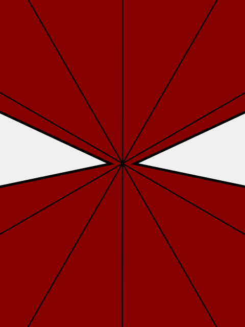

# Manuale di Programmazione Cinematografica
> Il cinema tra le righe... di codice!

__by Daniele Olmisani__

Minimalist movie posters generated using Processing programming language.

This collection of code snippets will be included in my book "Manuale di Programmazione Cinematografica". A survey of computer programming exercises using Java and Processing.

See also the complete project [filmography](filmography.tsv).

This project is hosted and maintained on [GitHub](https://github.com/mad4j/book-mdpc).

## Last Release
Use PDE `File -> Examples... -> Add examples` or follow these links to manually download MdPC code sketches:
- [complete ZIP file](http://mad4j.github.io/book-mdpc/book-mdpc.zip)
- [release description](http://mad4j.github.io/book-mdpc/book-mdpc.txt)

## Volume 1

 

 

 

 

## Volume 2

 

 

 

 

## Volume 3

 

 

 

 

## Volume 4

 

 

 

 

## Volume 5

 

## References
* [Processing Main page](https://processing.org/)
* [Processing Examples Contribution](https://github.com/processing/processing/wiki/Examples-Overview)
* [IMDB](http://www.imdb.com/)
* [OMDB API](http://www.omdbapi.com/)
