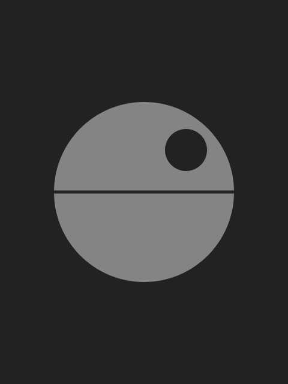
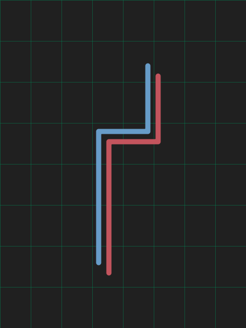
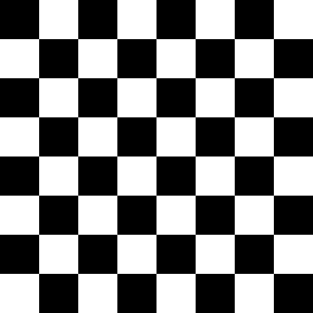
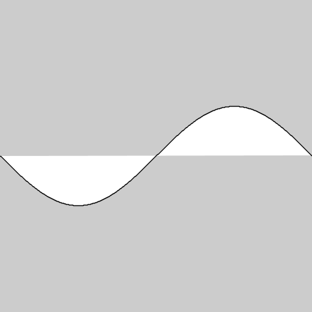

# Manuale di Programmazione Cinematografica
Minimalist movie posters generated using Processing programming language.

List of movies: http://www.imdb.com/title/tt0086567

This the collection of code snippets is included in my book "Manuale di Programmazione Cinematografica". A survey of computer programming exercises using Java and Processing.

Three main categories of snippets:
* Movies
* Tutorials
* Bonus Pack

## Movies

## Samples

## Making Movies

