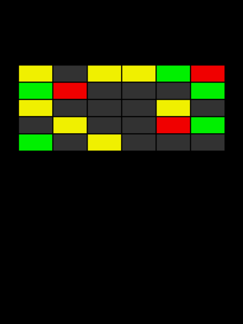
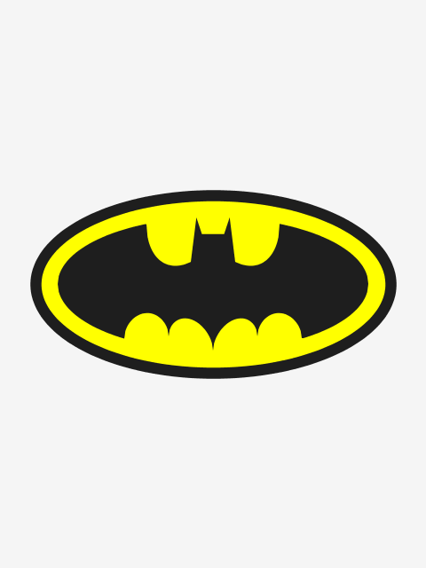
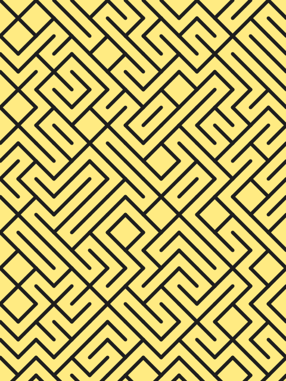

# Manuale di Programmazione Cinematografica
Minimalist movie posters generated using Processing programming language.

List of movies: http://www.imdb.com/list/ls072930876/

This collection of code snippets will be included in my book "Manuale di Programmazione Cinematografica". A survey of computer programming exercises using Java and Processing.

## Volume 1

## Volume 2

## Volume 3

## References
* [Processing Main page](https://processing.org/)
* [Processing Examples Contributiion](https://github.com/processing/processing/wiki/Examples-Overview)
