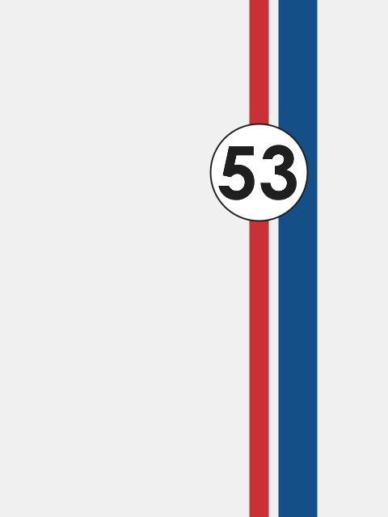

# The Love Bug (1968)

Comedy, Family, Sport

## Plot
A race car driver becomes a champion with a Volkswagen Beetle with a mind of its own.

[details](https://www.imdb.com/title/tt0064603/)

## Movie Poster



## The code
```java
// Manuale di Programmazione Cinematografica
// Daniele Olmisani, 2015

// The love bug (1968)


final color PAPER = color (240, 240, 240);
final color INK1 = color(200, 50, 55);
final color INK2 = color(20, 80,135);
final color INK3 = color(30, 30, 30);

PFont font;


void setup() {
  
  size(480, 640);
  noLoop();
  
  font = loadFont("CenturyGothic-Bold-192.vlw");
}


void draw() {
  
  final float S = 0.05 * min(width, height);
  
  background(PAPER);
  
  stroke(INK1);
  strokeWeight(S);
  line(2*width/3.0, 0, 2*width/3.0, height);
  
  stroke(INK2);
  strokeWeight(2*S);
  line(2*width/3.0+2*S, 0, 2*width/3.0+2*S, height);
  
  stroke(INK3);
  
  strokeWeight(0.08*S);
  ellipse(2*width/3.0, height/3.0, 5*S, 5*S);
  
  fill(INK3);
  textFont(font, 3.8*S);
  textAlign(CENTER, CENTER);
  text("53", 2*width/3.0, height/3.0);
  
  save("the-love-bug.png");
}

```

> MdPC - a collection of minimalist movie posters
> by Daniele Olmisani
> Please, see [LICENSE](../../../LICENSE) file
