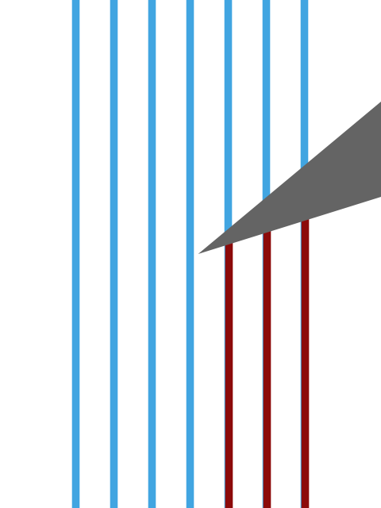

# Psycho (1960)

1960

## Il film in breve
A Phoenix secretary embezzles $40,000 from her employer's client, goes on the run, and checks into a remote motel run by a young man under the domination of his mother.

[dettagli](https://www.imdb.com/title/tt0054215/)

## La locandina



## Il codice
```processing
// Manuale di Programmazione Cinematografica - Volume 4
// Daniele Olmisani, 2017

// Psycho (1960)


final color PAPER = color(255);
final color INK1 = color(65, 165, 225);
final color INK2 = color(140, 10, 10);
final color INK3 = color(100, 100, 100);

final float U = 0.002;


void setup() {
  
  size(480, 640);
  noLoop();
}


void draw() {
  
  final float F = min(width, height);
  
  translate(0.5*width, 0.5*height);
  scale(F);
  
  background(PAPER);
  
  strokeWeight(10*U);
  
  stroke(INK1);
  for (float i=-0.3; i<=0.3; i+=0.1) {
    line(i, -1, i, 1);
  }
  
  stroke(INK2);
  for (float i=0.1; i<=0.3; i+=0.1) {
    line(i, -i*0.5, i, 1);
  }
  
  fill(INK3);
  noStroke();
  triangle(0.02, 0, 0.5, -0.4, 0.5, -0.15);
  
  save("psycho.png");
}
```
