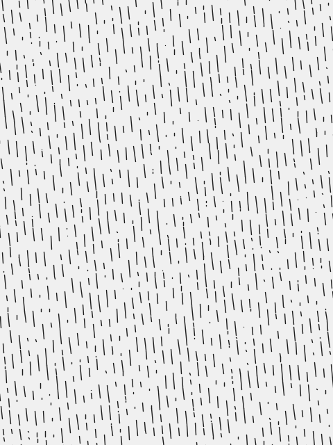

# Black Rain (1989)

Action, Crime, Thriller

## Plot
Two NYC cops arrest a Yakuza member and must escort him when he's extradited to Japan.

[details](https://www.imdb.com/title/tt0096933/)

## Movie Poster



## The code
```java
// Manuale di Programmazione Cinematografica
// Daniele Olmisani, 2020

// Black Rain (1989)


final color PAPER = color(240);
final color INK = color(30);

final int ROWS = 80;


void setup() {
  size(480, 640);  
  noLoop();
}


void draw() {
  
  final float S =  min(width, height);
  final float U = 0.002;
    
  translate(0.5*width, 0.5*height);
  rotate(-0.1);
  scale(S);

  randomSeed(0);

  background(PAPER);

  stroke(INK);
  strokeWeight(1.5*U);
  
  for (float w=-1.0; w<1.0; w+=(2.0/ROWS)) {
    float a, b = -0.8;
    while (b < 0.8) {
      a = b + random(0.05);
      b = a + random(0.05);
      line(w, a, w, b);
    }
  }

  save("black-rain.png");
}

```

> MdPC - a collection of minimalist movie posters
> by Daniele Olmisani
> Please, see [LICENSE](../../../LICENSE) file
