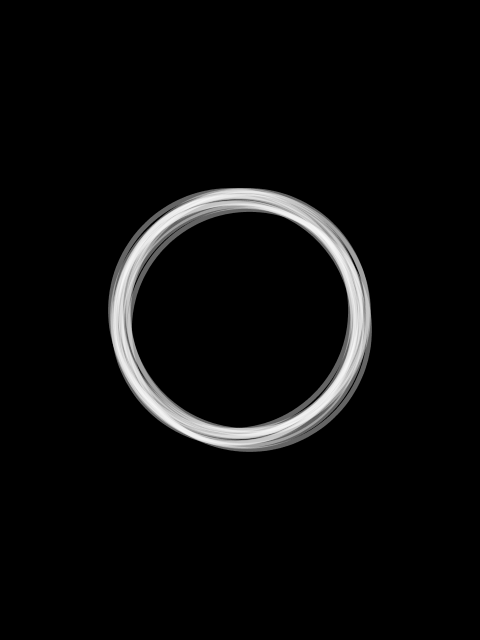

# The Ring (2002)

Horror, Mystery

## Plot
A journalist must investigate a mysterious videotape which seems to cause the death of anyone one week to the day after they view it.

[details](https://www.imdb.com/title/tt0298130/)

## Movie Poster



## The code
```java
// Manuale di Programmazione Cinematografica
// Daniele Olmisani, 2019

// The Ring (2002)


final color PAPER = color(0);
final color INK= color(255);
final float ALPHA = 100;

final int COUNT = 15;
final float OFFSET = 0.02;
final int WEIGHT = 5;
final float RADIUS = 0.5;


void setup() {
  size(480, 640);
  noLoop();
}


void draw() {
  
  final float U = 0.002;
  final float S = min(width, height);
  
  translate(0.5*width, 0.5*height);
  scale(S);
  
  randomSeed(0);
  
  background(PAPER);
  
  noFill();
  stroke(INK, ALPHA);
  strokeWeight(WEIGHT*U);
  
  for (int i=0; i<COUNT; i++) {
    float dx = random(-OFFSET, +OFFSET);
    float dy = random(-OFFSET, +OFFSET);
    ellipse(dx, dy, RADIUS, RADIUS);
  }
  
  save("the-ring.png");
}

```

> MdPC - a collection of minimalist movie posters

> by Daniele Olmisani

> Please, see [LICENSE](../../../LICENSE) file
