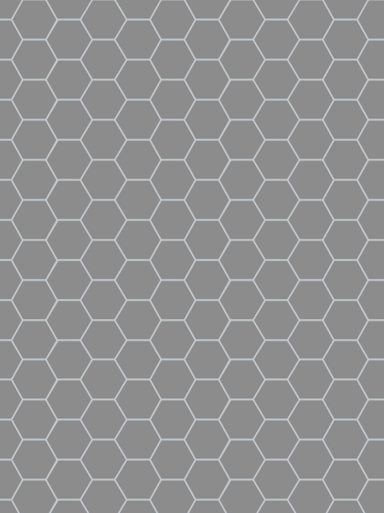

# Ex Machina (2014)

Drama, Sci-Fi, Thriller

## Plot
A young programmer is selected to participate in a ground-breaking experiment in synthetic intelligence by evaluating the human qualities of a highly advanced humanoid A.I.

[details](https://www.imdb.com/title/tt0470752/)

## Movie Poster



## The code
```java
// Manuale di Programmazione Cinematografica
// Daniele Olmisani, 2021

// Ex Machina (2014)


final color PAPER = color(135, 100, 30);
final color INK = color(210, 180, 100);

final int SIDES = 6;
final float RADIUS = 0.06;
final float ANGLE = TWO_PI / SIDES;

final int COUNT = (int)(1.5 / RADIUS);


void setup() {
  size(480, 640);
  noLoop();
}


void draw() {
  final float S =  min(width, height);
  final float U = 0.002;
  
  //translate(0.5*width, 0.5*height);
  scale(S);
  
  background(PAPER);
  
  fill(PAPER);
  stroke(INK);
  strokeWeight(2*U);
  
  float dx = 1.5*RADIUS;
  float dy = sqrt(3)*RADIUS;
  float of = 0.5*sqrt(3)*RADIUS;
  
  for (int i=0; i<COUNT; i++) {
    for (int j=0; j<COUNT; j++) {
      drawHex(i*dx, j*dy+(i%2*of), RADIUS);
    }
  }
  
  save("ex-machina.png");
}


void drawHex(float cx, float cy, float r) {
  
  beginShape();
  for (int i=0; i<SIDES; i++) {
    vertex(cx+r*cos(i*ANGLE), cy+r*sin(i*ANGLE));
  }
  endShape(CLOSE);
  
}

```

> MdPC - a collection of minimalist movie posters
> by Daniele Olmisani
> Please, see [LICENSE](../../../LICENSE) file
