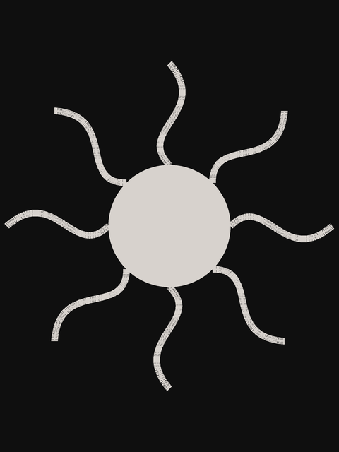

# Spectre (2015)

Action, Adventure, Thriller

## Plot
A cryptic message from James Bond's past sends him on a trail to uncover the existence of a sinister organisation named SPECTRE.

[details](https://www.imdb.com/title/tt2379713/)

## Movie Poster



## The code
```java
// Manuale di Programmazione Cinematografica
// Daniele Olmisani, 2024

// SPECTRE (2015)


void setup() {
  size(600, 600);
  smooth();
  noLoop();
}


void draw() {
  background(255);

  // Sposta l'origine al centro della finestra, leggermente rialzata
  translate(width / 2, height / 2 - 30);

  noStroke();
  fill(195, 25, 25);

  beginShape();

  // PUNTO DI PARTENZA: Testa in alto al centro
  vertex(0, -120);

  // --- LATO DESTRO ---
  // Testa (curva destra)
  bezierVertex(60, -120, 60, -60, 35, -40);

  // Spalla destra (curva ampia verso l'esterno)
  bezierVertex(70, -20, 150, -60, 190, 10);

  // Tentacolo esterno (3° da destra) - punta
  bezierVertex(210, 45, 190, 100, 175, 120);

  // Membrana tra 3° e 2° tentacolo
  bezierVertex(165, 60, 155, 10, 145, 10);

  // Tentacolo medio (2° da destra) - punta
  bezierVertex(135, 10, 130, 80, 120, 140);

  // Membrana tra 2° e 1° tentacolo
  bezierVertex(110, 70, 100, 20, 90, 20);

  // Tentacolo interno (1° da destra) - punta
  bezierVertex(80, 20, 75, 90, 65, 160);

  // Membrana tra 1° tentacolo e centrale
  bezierVertex(55, 80, 45, 30, 35, 30);

  // Tentacolo centrale - punta (il più lungo)
  bezierVertex(25, 30, 15, 150, 0, 250);

  // --- LATO SINISTRO (Specchiato perfettamente) ---
  // Invertiamo i valori X e l'ordine per chiudere la forma senza interruzioni

  // Tentacolo centrale (risalita lato sinistro)
  bezierVertex(-15, 150, -25, 30, -35, 30);

  // Membrana tra centrale e 1° sinistro
  bezierVertex(-45, 30, -55, 80, -65, 160);

  // Tentacolo interno (1° da sinistra)
  bezierVertex(-75, 90, -80, 20, -90, 20);

  // Membrana tra 1° e 2° sinistro
  bezierVertex(-100, 20, -110, 70, -120, 140);

  // Tentacolo medio (2° da sinistra)
  bezierVertex(-130, 80, -135, 10, -145, 10);

  // Membrana tra 2° e 3° sinistro
  bezierVertex(-155, 10, -165, 60, -175, 120);

  // Tentacolo esterno (3° da sinistra)
  bezierVertex(-190, 100, -210, 45, -190, 10);

  // Spalla sinistra
  bezierVertex(-150, -60, -70, -20, -35, -40);

  // Testa (curva sinistra fino a chiudere)
  bezierVertex(-60, -60, -60, -120, 0, -120);

  endShape(CLOSE);

  save("spectre.png");
}

```

> MdPC - a collection of minimalist movie posters
> by Daniele Olmisani
> Please, see [LICENSE](../../../LICENSE) file
