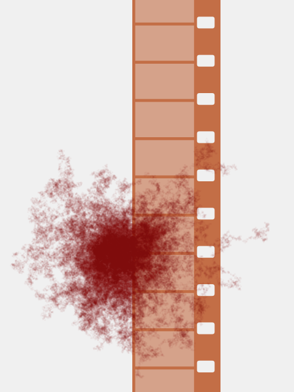

# Eight Millimeter (1999)

Crime, Drama, Mystery, Thriller

## Plot
A private investigator is hired to discover if a "snuff film" is authentic or not.

[details](https://www.imdb.com/title/tt0134273/)

## Movie Poster



## The code
```java
// Manuale di Programmazione Cinematografica
// Daniele Olmisani, 2021

// 8MM (1999)


final color PAPER = color(240);
final color INK1 = color(195, 110, 70);
final color INK2 = color(140, 0, 0);

final int DROPS = 100;
final int OFFSET = 3;
final int ITERATIONS = 2000;

float[] px = new float[DROPS];
float[] py = new float[DROPS];


void setup() {
  size(480, 640);
  noLoop();
  
  randomSeed(100);
  
  for (int i=0; i<DROPS; i++) {
    px[i] = 0.0;
    py[i] = 0.0;
  }
}

void draw() {
  final float S =  min(width, height);
  final float U = 0.002;
  
  translate(0.5*width, 0.5*height);
  scale(S);
  
  background(PAPER);
  
  noStroke();
  fill(INK1);
  
  rectMode(CENTER);
  rect(0.1, 0.0, 0.3, 2.2);
  
  fill(PAPER);
  for (int i=-7; i<7; i++) {
    rect(0.2, 0.06+i*0.13, 0.06, 0.04, 0.008);
  }
  
  fill(0x66FFFFFF & PAPER);
  for (int i=-7; i<7; i++) {
    rect(0.06, i*0.13, 0.2, 0.12);
  }
  
  translate(-0.1, 0.2);
  for (int i=0; i<ITERATIONS; i++) {
    spreadDrops(px, py, U, OFFSET);
  }
    
  save("8mm.png");
}


void spreadDrops(float[] px, float[] py, float scale, float offset) {
  strokeWeight(scale*offset);
  stroke(0x0AFFFFFF & INK2);
  for (int i=0; i<DROPS; i++) {
    px[i] += scale*random(-offset, offset);
    py[i] += scale*random(-offset, offset);
    
    point(px[i], py[i]);
  }
}

```

> MdPC - a collection of minimalist movie posters
> by Daniele Olmisani
> Please, see [LICENSE](../../../LICENSE) file
