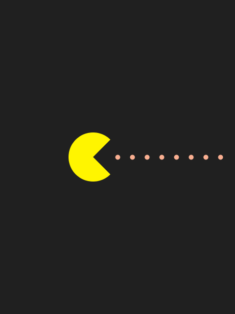

# Making Movies
Minimalist movie posters generated using Processing programming language.

2015, Daniele Olmisani

See also: [Manuale di Scrittura Cinematografica](https://github.com/mad4j/processing-movies/blob/master/manuale-di-programmazione-cinematografica/README.md)

