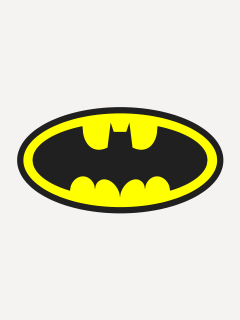

# Manuale si Scrittura Cinematografica
### Esercizi di scrittura di immagini

Materiale per il libro "Manuale di Scrittura Cinematografica".
2015, Daniele Olmisani

Lista completa su IMDB: http://www.imdb.com/list/ls072930876/

## Movies

## Samples

